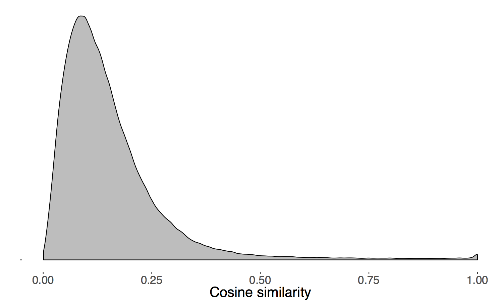
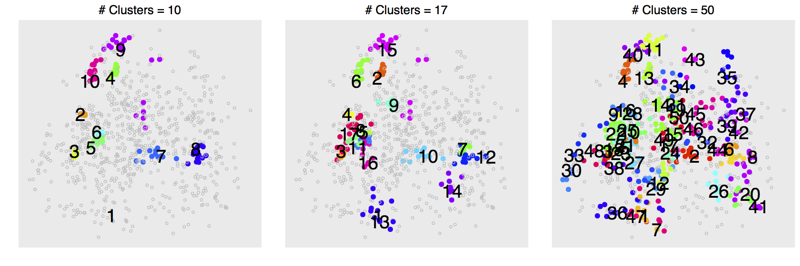
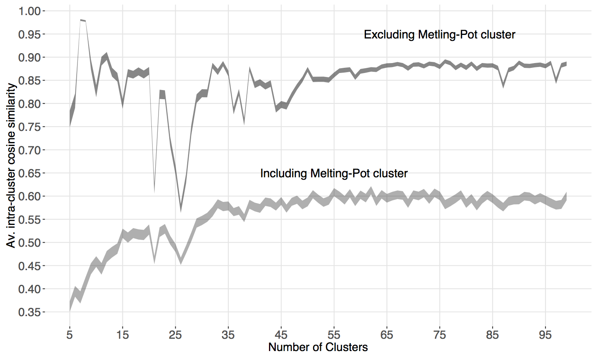
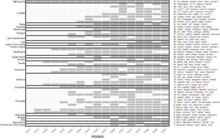
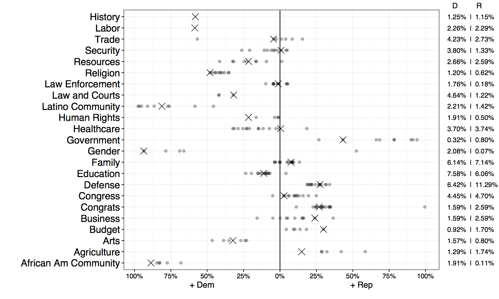

# Wilkerson & Casas (2016) Text-As-Data *ARPS*
Replication material for the paper by John Wilkerson and Andreu Casas on Text as Data at the Annual Review of Political Science:

Wilkerson, John and Andreu Casas. 2016. "Large-scale Computerized Text Analysis in Political Science: Opportunities and Challenges." *Annual Review of Political Science*, VV:p-p.

---

## Instructions

- Clone the repository
- Open the `R` project `wilkerson_casas_2016_TAD` in `RStudio`
- The `data` directory in this repository contains all the final datasets we used in the paper
- The text and metadata of the one-minute floor speeches can be found in the python module we developed to estimate Robust Latent Dirichlet Allocation models: [rlda](Robust Latent Dirichlet Allocation models)
- The `01_getting_models_and_clusters.py` reproduces the construction of the final datasets
- All the other scripts replicate the Figures in the paper

---

**A**. `01_getting_models_and_clusters.py`

**Only run this script if you want to generate again the main datasets used in the article.** Skip otherwise: the `data` directory in this repository already contains the datasets needed to replicate the article's Figures. However, since algorithms randomly choose starting points when estimating topic models and clusters, the topic and cluster numbers that you get may be different than the ones we use in the other scripts. To exactly replicate the figures in the paper, simply run the other scripts, which pull out all our exact same data from the data directory in this repository.

This is a python script that does the following:
  - Reads and pre-processes 9,704 one-minute floor speehces from the 113th Congress.
  - Estimates 17 [LDA](https://pypi.python.org/pypi/lda) topic models with different numbers of `k` topics (`k` = {10, 15, ..., 90}) 
  - Classifies the speeches 17 times according to the models and saves the classifications in `csv` fromat in the `data/classifications` directory.
  - Calculates the pairwise cosine similarity (n = 722,500) between all topics (n = 850) from the 17 models and saves the similarity scores in `csv` format: `cos_list.csv`
  - Uses [Spectral Clustering](http://scikit-learn.org/stable/modules/clustering.html#spectral-clustering) and the cosine similarity scores to cluster topics into `c` number of clusters (`c` = {5, 10, ..., 95}). Saves the resulting clusters in the `data/clusters` directory.
  The script uses a `python` module initially written for this paper: [rlda](https://github.com/CasAndreu/rlda) (Robust Latent Dirichlet Allocation)

**B**. `02_figure_2.R`: Replication of Figure 2 of the paper.

  

**C**. `03_figure_3.R`: Replication of Figure 3 of the paper.

  

**D**. `04_figure_4.R`: Replication of Figure 4 of the paper.

  

**E**. `05_figure_5.R`: Replication of Figure 5 of the paper.

  

**F**. `06_figure_7.R`: Replication of Figure 7 of the paper.

  

